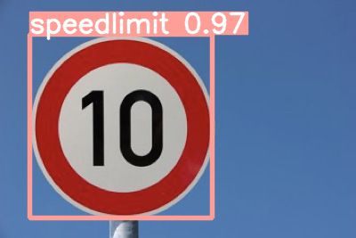
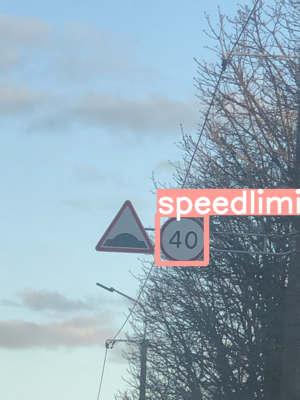
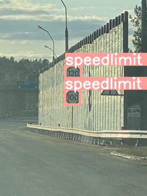
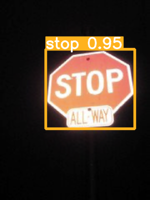

# Road Sign Detection with YOLOv5

In this project, I trained a YOLOv5 model to detect common road signs such as Stop Signs 🛑, Crosswalk 🚶‍♀️, Speed Limit sign 🚗 and Traffic Lights 🚦. Training with YOLOv5 is very simple, just create annotations in the format that YOLO likes and just train the model and use the model to generate inferences. 

# Steps to train the model

- Download the dataset
- Use the preprocessing script to convert the VOC style annotations to YOLO style annotations
- Train the model
- Use the model weights to perform inferencing on images

# Training YAML file that need modification

The YAML file that is used to perform training nees some path modifications as well as class nae modifications to accomodate our dataset.

```
path: ../ # Path to the root of the project

train:
  - images # Path to Images used for training in the root folder
val:
  - images # Path to the Images used for validation in the root folder

names:
  0: trafficlight
  1: speedlimit
  2: crosswalk
  3: stop
```

# Final Model Performance

```
Epoch    GPU_mem   box_loss   obj_loss   cls_loss  Instances       Size
      49/49      1.24G     0.0146   0.005516    0.00073         26        320: 100% 55/55 [00:25<00:00,  2.17it/s]
                 Class     Images  Instances          P          R      mAP50   mAP50-95: 100% 28/28 [00:10<00:00,  2.80it/s]
                   all        877       1244      0.969      0.944      0.975      0.807
```

The number we want to look at is the `mAP50-95`, the higher the number the better the performance of the model is.

# Sample Detections 👓









And as you can see, the confidence of the trained model is pretty good and keep in mind the model is only trained for `50 epochs` and performance is soooo good 👍.